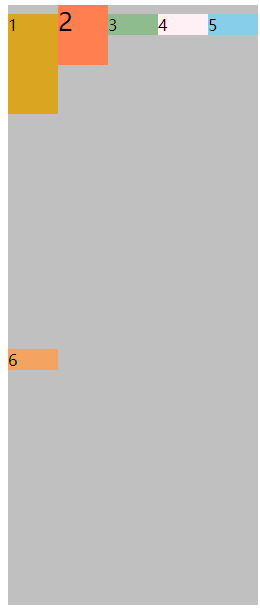

# Flex布局

Flex布局支持IE10及以上版本浏览器。

使用flex布局先要设置`display:flex`或者`display:inline-flex`

## display属性值flex和inline-flex

- flex属性值

  给容器display设置flex，那么容器宽度默认100%，和block类似。

- inline-flex属性值

  给容器display设置inline-flex，容器的宽度默认由里面的元素撑开，和inline-block类似

## flex-direction

作用：设置主轴的方向，默认横向，有4个值row，row-reverse,column,column-reverse

- row默认值，主轴在水平方向，起点在左
- row-reverse主轴在水平方向，起点在右
- column主轴方向垂直，起点在上
- column主轴方向垂直，起点在下

## flex-wrap

作用：如果项目一条上线排不下换行。默认在一条线上。有3个值，wrap，nowrap，wrap-reverse

- nowrap默认值，不换行
- wrap，一条线占满，换行排列
- wrap-reverse，换行，第一行在最后

## flex-flow

作用：组合属性 flex-direction和flex-wrap，默认值row nowrap

## justify-content

作用：项目在主轴的对齐方式，有5个值，flex-start,flex-end,center,space-between,space-around默认flex-start

- flex-start 默认值。主轴起点方向对齐。如果主轴方向row：那么项目靠左对齐，row-reverse：项目右对齐。同理column上对齐，column-reverse下对齐。
- flex-end 与flex-start对齐方向方向相反。如果主轴方向row：那么项目靠右对齐，row-reverse：项目左对齐。同理column下对齐，column-reverse上对齐。
- center 居中对齐
- space-between 两端对齐。剩余空间平分给项目间距。
- space-around 环绕对齐，每个项目两侧的间距相等，项目之间间距是边距的2倍。

## align-items

作用：交叉轴对齐方式，有5个值，flex-start,felx-end,center,baseline,stretch

- flex-start交叉轴起点方向对齐。

- flex-end交叉轴终点方向对齐。

- center居中对齐

- stretch拉伸项目撑满交叉轴对齐，项目有宽高会影响拉伸。

- baseline基线对齐。文字的基线。

  

## align-content

作用：轴线对齐方式，假设flex-wrap:wrap，第一行占满，产生了换行。此时有两行，这两行的在交叉轴上的对齐方式。flex-start,flex-end,center,space-between,space-around,stretch。默认值stretch。

- flex-start多行交叉轴起始方向对齐。
- flex-end多行交叉轴终点方向对齐。
- center多行交叉轴中心对齐。
- space-between行间距相等，平分交叉轴剩余空间。
- space-around行两边留白相等，所以行间距是边距的2倍。
- stretch默认值，多行拉伸占满交叉轴空间。

> 以上为主轴默认为row，交叉轴竖直方向。如果主轴方向column，那么为多列在交叉轴上的对齐方式。

**以上属性全部都是写在父容器上，下面为flex布局作用在项目上的属性**

## order

作用：根据属性值大小排序项目，数值越小排列越靠前，默认值是0，属性值可以为负数。

## flex-grow

作用：定义项目的放大比例，默认为0，即存在剩余空间也不放大。如果所有项目都设置`flex-grow:1`那么所有项目将平分剩余空间。按比例划分剩余空间。

## flex-shrink

作用：空间不足时是否缩小，0不缩小，正值缩小。默认为1，空间不足项目缩小，负值无效。

## flex-basis

作用：分配多余空间前，项目占据的主轴空间。默认值`auto`，即项目原始尺寸。可以为长度值，例如`flex-basis：200px`

## flex

作用：`flex-grow`、`flex-shrink`、`flex-basis` 的复合属性。默认值0 1 auto。可选值auto（1 1 auto）具有弹性，none（0 0 auto）不具有弹性。

## align-self

允许单个项目有与其他项目不一样的对齐方式，可覆盖align-items。默认auto表示集成align-items的对齐方式

可选属性值`flex-start`、`flex-end`、`center`、`stretch`、`baseline`、`auto`。

