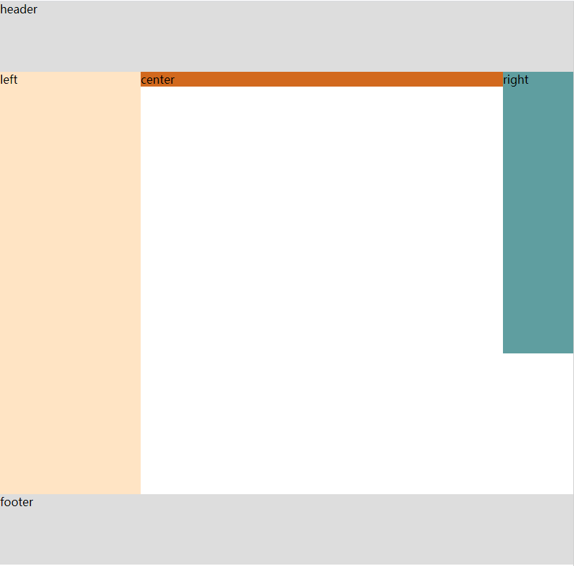
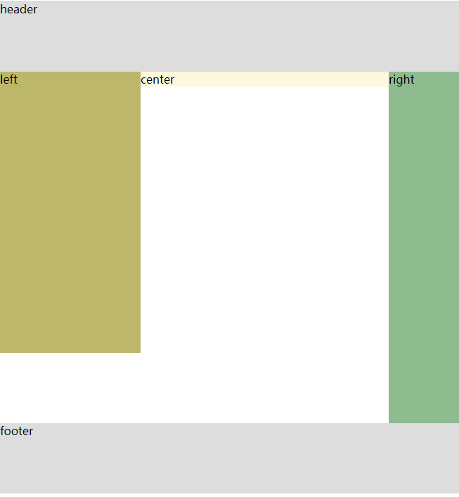

# 圣杯布局和双飞翼布局

圣杯和双飞翼布局都是为了实现两侧宽度固定中间自适应的三栏布局。

## 圣杯布局

- html部分

```html
<!DOCTYPE html>
<html lang="en">
<head>
    <meta charset="UTF-8">
    <meta name="viewport" content="width=device-width, initial-scale=1.0">
    <title>圣杯布局</title>
</head>
<body>
    <header>header</header>
    <div id="container">
        <div id="center">center</div>
        <div id="left">left</div>
        <div id="right">right</div>
    </div>
    <footer>footer</footer>
</body>
</html>
```

- css部分

```css
 * {
     margin: 0;
     padding: 0;
}

header,
footer {
    background-color: #ddd;
    height: 100px;
}
body{ 
    min-width: 500px;
}
#container {
    padding-left: 200px;
    padding-right: 100px;
    overflow: hidden;
}

#center {
    background-color: chocolate;
    width: 100%;
    float: left;
}

#left {
    width: 200px;
    height: 600px;
    background-color: bisque;
    float: left;
    margin-left: -100%;
    position: relative;
    right: 200px;
}

#right {
    width: 100px;
    height: 400px;
    background-color: cadetblue;
    float: left;
    margin-right: -100px;
}
```

- 效果如图



## 双飞翼布局

- html部分

```html
<!DOCTYPE html>
<html lang="en">
<head>
    <meta charset="UTF-8">
    <meta name="viewport" content="width=device-width, initial-scale=1.0">
    <title>双飞翼布局</title>
</head>
<body>
    <header>header</header>
    <div id="container">
        <div id="center">center</div>
    </div>
    <div id="left">left</div>
    <div id="right">right</div>
    <footer>footer</footer>
</body>
</html>
```

- css部分

```css
*{
    padding: 0;
    margin: 0;
}
body{
    min-width: 400px;
}
header,footer{
    background-color: #DDD;
    height: 100px;
    clear: both;
}
#container{
    float: left;
    width: 100%;
}
#center{
    background-color: cornsilk;
    margin-left: 200px;
    margin-right: 100px;
}
#left{
    background-color: darkkhaki;
    width: 200px;
    height: 400px;
    float: left;
    margin-left: -100%;
}
#right{
    background-color: darkseagreen;
    width: 100px;
    height: 500px;
    float: left;
    margin-left: -100px;
}
```

- 实现效果如下



