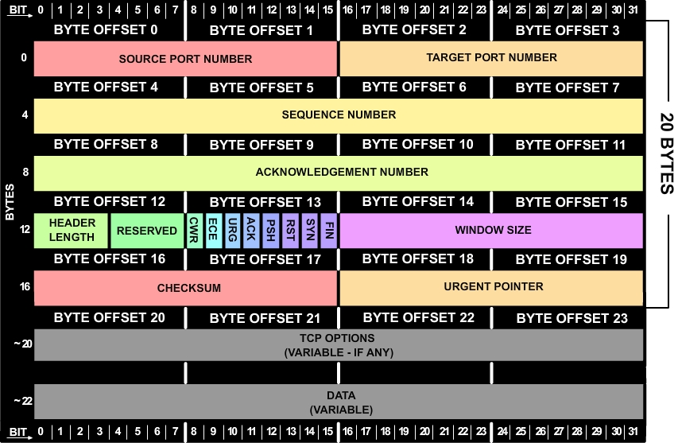

# TCP三次握手和四次挥手

## TCP报文结构

- 第0-1字节：源端口号，占两个字节
- 第2-3字节：目的端口号，占两个字节
> 注：端口号范围0-65535，即2的16次方，也就正好两个字节。
- 第4-7字节：数据序列号，占四个字节。作用：数据很大，需要分包传输这时就要为数据包进行编号，假设：知道了当前数据包的编号100，下一个包的数据号为200，那么当前数据包负载为100字节，这样接收到数据包时就可以将数据包恢复成分包之前的原数据。
- 第8-11字节：确认序列号，占四个字节。作用：期待下一次接收到对方的数据包的序列号。
- 第13字节：标志位，共8个标志位。每个标志位占1bit，只有0或1两个值。重点介绍一下TCP三次握手和四次挥手过程中需要用到的标志位：
> SYN：同步比特，为1时表示，当前TCP数据包请求发起连接。ACK：确认比特，为1时表示，确认序列号有效。FIN：终止比特，为1时表示，数据发送完毕，当前TCP数据包请求释放连接。
## TCP建立连接时的三次握手
> 上面介绍TCP报文格式是为了帮助理解。**三次握手本质上是发送端和接收端之间传递的三个数据包以确定连接建立成功**。
### 第一次握手
发送端将数据包的序列号`seq=x`，同步比特`SYN=1`，然后将数据包发送给接收端。此时发送端状态：`SYN_SENT`，等待接收端确认。
### 第二次握手
接收端收到数据包同步比特`SYN=1`，知道了发送端请求建立连接；新建一个数据包，确认序号`ack=x+1`（即发送端的数据序列号+1），随机序列号`seq=y`（每个数据包都会生成数据序列号`seq`），确认标志位`ACK=1`（当前数据包中的确认序列号`ack`有效），同步标志位`SYN=1`（当前数据包请求与发送端建立连接），该数据包发送给发送端；此时接收端状态：`SYN_RCVD`,等待发送端确认。
### 第三次握手
发送端发送确认数据包，此时同步序列号`seq=x+1`，确认序列`ack=y+1`，确认比特`ACK=1`。
## TCP断开连接四次挥手
### 第一次挥手

- 发送端做好准备，请求断开连接

- 发送端给接收端发送数据包，数据包终止比特`FIN=1`，序列号`seq=a`。

### 第二次挥手

- 接受端接收到断开连接请求，响应发送端。
- 接收端接收到数据包，`FIN=1`，知道发送端请求断开连接。于是给发送端发送数据包，数据包序列号`seq=b`，确认序列号`ack=a+1`，确认比特`ACK=1`。

### 第三次挥手

- 第二次握手后，接受端可能存在未发送完的数据包，等数据发送完毕，开始第三次握手，告诉发送端这边已经做好断开连接的准备。

- 接受端给发送端发送数据包，数据包序列号`seq=c`，确认序列号`ack=a+1`，终止比特`FIN=1`，确认比特`ACK=1`。

### 第四次挥手

- 发送端响应接收端的断开连接请求
- 发送端发送数据包给接收端，数据包的序列号`seq=a+1`，确认序列号为`ack=c+1`，确认比特`ACK=1`。
- 发送端等待2MSL（MSL Maximum Segment Lifetime 报文最大存活时间）2个MSL是因为ACK数据包发送到接收端为1MSL，假设接收没有接收到ACK数据包，那么它会重新发送FIN数据包给发送端，即第二个MSL。

### 问题

1. 第二次和第三次为什么不合并？（情景：客户端发送了FIN，但是服务端仍然存在要发送的数据）

   因为当客户端发送FIN数据包的时候，仅代表客户端做好了断开连接的准备，即客户端不会再发送数据了。此时服务端接收到FIN数据包，返回ACK数据包通知客户端自己收到了，但是服务端还有数据需要发送给客户端；如果第二次与第三次合并，那么服务端还有数据要发送给客户端时，服务端就不能及时的发送这个合并包，客户端也就不知道服务端是否收到了自己的FIN数据包，那么客户端就会重新发送FIN数据包。