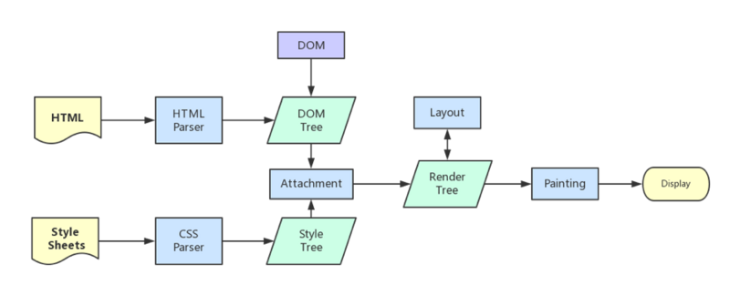

# 浏览器的重绘(repaint)与重排(reflow)

## 网页生成过程

1. HTML 被 HTML 解析器（html parser）解析成 DOM 树。

2. CSS 被 CSS 解析器（css parser）解析成 CSSOM 树。
3. DOM 树和 CSSOM 树合成渲染树（render tree），这一步被称为 Attachment。
4. 生成布局（flow），即将渲染树的所有节点进行布局。
5. 绘制（paint）显示整个页面。

> 其中第 4 步和第 5 步最耗费性能。即重排和重绘。



## 重排

1. 触发重排的原因：重排是因为 DOM 的尺寸位置等几何属性发生变化导致浏览器需要重新计算生成渲染树，调整布局。

2. 触发重排的操作：

   - 第一次加载页面，所有 DOM 都要进行首次布局，这是开销最大的一次重排。
   - 调整浏览器窗口尺寸。
   - 元素位置尺寸发生变化。
   - 增加或删除元素。
   - 元素内容发生变化。
   - 元素字体大小发生变化。
   - 激活 CSS 伪类（:hover）。
   - 设置 style 属性。
   - 查询属性例如以下属性：

   | 属性名       | 作用                                                                                                                           | 属性名      | 作用                                                                                             |
   | ------------ | ------------------------------------------------------------------------------------------------------------------------------ | ----------- | ------------------------------------------------------------------------------------------------ |
   | width        | 宽度                                                                                                                           | height      | 高度                                                                                             |
   | margin       | 外边距                                                                                                                         | padding     | 内边距                                                                                           |
   | offsetTop    | 元素位于祖先元素 offsetParent(祖先元素满足 position 不为 static，或者是 body，table，th，td)内容区域(padding+content)的 y 坐标 | offsetLeft  | 元素位于祖先元素(祖先元素满足 position 不为 static，或者是 body，table，th，td)内容区域的 x 坐标 |
   | offsetHeight | content+padding+border 的高度                                                                                                  | offsetWidth | content+padding+border 的宽度                                                                    |
   | scrollTop    | 获取或设置一个元素的内容垂直滚动的像素数                                                                                       | scrollLeft  | 获取或设置一个元素的内容水平滚动的像素数                                                         |
   | scrollHeight | 元素内容高度包含不可见区域                                                                                                     | scrollWidth | 元素内容宽度包含不可见区域                                                                       |
   | clientTop    |                                                                                                                                | clientLeft  |                                                                                                  |
   | clientHeight | 元素高度不包含横向滚动条，只是 padding+content(只读)                                                                           | clientWidth | 同理                                                                                             |

3. 渲染队列机制

   当我们修改元素几何属性时触发重排时，浏览器会将这些操作放入渲染队列，等队列中操作达到一定数量或时间间隔时批量处理。例如：

   ```javascript
   div.style.width = "20px";
   div.style.height = "20px";
   div.style.top = "20px";
   div.style.left = "20px";
   ```

   上面代码理论上触发四次重排，实际上触发一次，因为每次操作都会放到渲染队列中最后一起执行。

   强制进行重排：

   ```javascript
   div.style.width = "20px";
   console.log(div.offsetWidth);
   div.style.height = "20px";
   console.log(div.offsetHeight);
   div.style.top = "20px";
   console.log(div.offsetTop);
   div.style.left = "20px";
   console.log(div.offsetLeft);
   ```

   这段代码实际触发四次重排，原因是 console.log 读取几何属性时，发现渲染队列中有操作，需要立马执行清空队列，保证几何属性的实时性，准确性。所以读取属性可以强制进行重排。

## 重绘

1. 触发原因：元素外观发生改变，但是并没有改变布局，只需执行生成页面的最后一步将页面进行重绘即可。
2. 触发重绘：改变元素颜色，border-style，visibility 等。

## 优化建议

- 减少 DOM 操作
- 修改样式时聚合在一起操作
- 是使用 class 更改样式
